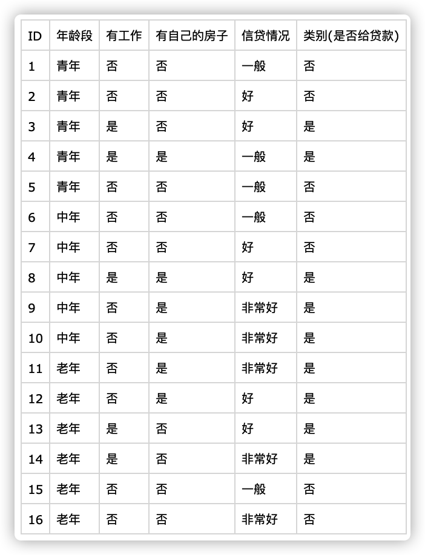
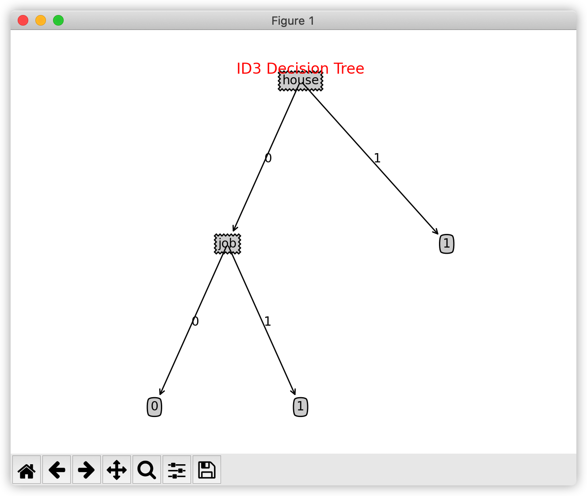

# 分类大作业 - 决策树ID3算法

[toc]

## 实验目的

调用已有ID3算法接口，并自行选择一个小数据集作为测试用例进行测试。

<br/>

## 实验环境

- **操作系统**：macOS Catalina 10.15.7
- **IDE**：PyCharm 2019.3.2
- **开发语言**：Python 3.7
- **主要依赖**：matplotlib==3.1.1, csv

### 如何运行

1. 安装所需要的依赖
2. 进入`src/`目录
3. 运行`main.py`脚本

```bash
pip install requirements.txt
cd src/
python main.py
```

### 项目结构

```
.
├── README.md
├── data
│   └── data.csv
├── requirements.txt
└── src
    ├── ID3.py
    ├── TreePlotter.py
    ├── __pycache__
    │   ├── ID3.cpython-37.pyc
    │   ├── TreePlotter.cpython-37.pyc
    │   └── util.cpython-37.pyc
    ├── main.py
    └── util.py
```

<br/>

## 实验内容

### 决策树算法

由数据的不同属性逐次划分数据集，直至得到的数据子集只包含同一类数据为止，这样可形成一棵树，成为决策树。

由树的根到某个叶子属性的合取可形成一条分类规则；所有规则的析取可形成一整套分类规则。

- **决策树生成算法**：自上而下递归的分治法构建树
  1. 开始时所有训练样本都在根结点
  2. 用一定的模型**选择属性**生成分支
     - 探试
     - 统计（信息增益，熵）
     - 一般树越小，预测能力越强
  3. 停止分裂
     1. 对于一个给定的节点，所有的样本属于同一类
     2. 没有剩余属性用于进一步分区，则分类叶子采用多数投票方式
  4. 直到所有样本都被计算
- **决策树修剪算法**：防止噪声和过拟合
  - 预剪枝：在生成树的同时决定是继续对不纯的训练子集划分还是停止
  - 后剪枝：一种拟合-化简的两阶段方法
    1. 首先构建一棵训练集完全拟合的树
    2. 使用一个测试集从叶开始剪枝，如果某个叶子剪去后测试集上的准确度不降低，则减去该叶子

### ID3算法

- **熵**
  - **公式**：$entropy(S) = -\sum_{i=1}^np_i * log_2p_i$
  - 样本概率分布均匀，则混乱度高，信息熵越大
  - 熵值越小，不确定信息越少，越有利于数据分类
  - 决策树的分支原则是使划分后样本的子集熵最小
- **信息增益**：衡量熵期望的减少值
  - **公式**：$gain(S,A) = entropy(S) - entroypy(S,A) \\ entropy(S,A) = \sum_{i=1}^m\frac{S_i}{S}entropy(S_i)$
  - 信息增益越大，因为知道A导致上的压缩越大，A对分类提供的信息越多
  - **选择获得最大信息增益的属性作为分支属性**
- **基本策略**
  1. 树以代表训练样本的单个节点开始
  2. 如果样本都在同一类中，则这个节点成为树叶节点并标记为该类别
  3. 否则算法使用信息增益作为启发知识帮助选择合适的将样本分类的属性
  4. 对测试属性的每个已知离散值创建一个分支，并据此划分样本
  5. 递归地形成每个划分熵的样本决策树
  6. 直到一下条件之一成立时停止
     - 给定节点的所有样本属于同一类
     - 没有剩余属性可以用来进一步划分样本，这时该节点作为树叶，并用剩余样本中出现最多的类型作为叶子节点的类型
     - 某一分支没有样本，以训练样本集中占多数的类型创建一个树叶
- **模型评价**
  - 优点：模型容易理解；噪声影响较小；分类速度快
  - 缺点 ：信息增益的计算依赖于特征数目较多的属性，而属性取值最多的属性不一定最优；算法非递增；结果非全局最优；只能处理离散属性数据，不能处理有缺失的数据

<br/>

## 实验过程

1. 读取数据
2. 构建ID3决策树
3. 绘制ID3决策树
4. 测试

### 测试样例说明

本实验选取的数据较为简单，为一家贷款公司是否对用户提供贷款详细信息的记录表格，有如下字段：

- ID
- **年龄段(age)**：青年｜中年｜老年
- **是否有工作(job)**：是｜否
- **是否有自己的房子(house)**：是｜否
- **信贷情况(loan)**：一般｜好｜非常好

希望据此判断可否给该用户提供贷款（type 是｜否）



### 核心算法实现

#### 信息熵计算

```python
def calcEntropy(dataset):
    '''
    计算信息熵 entropy(S) = -\sum_{i=1}^{n}(p_i * log_2p_i)
    :param dataset: 数据集(子集)
    :return: 信息熵
    '''
    numEntries = len(dataset)
    labelCounts = {}    # 给所有可能分类创建字典
    for featVec in dataset:
        currentlabel = featVec[-1]
        if currentlabel not in labelCounts.keys():
            labelCounts[currentlabel] = 0
        labelCounts[currentlabel] += 1

    Ent = 0.0
    for key in labelCounts:
        p = float(labelCounts[key]) / numEntries
        Ent = Ent - p * log(p, 2)
    return Ent
```

#### 划分数据集

```python
def splitDataset(dataset, axis, value):
    '''
    划分数据集
    :param dataset: 数据集(子集)
    :param axis: 属性值
    :param value: 特征值
    :return: 划分后的数据集合
    '''
    retdataset = []
    for featVec in dataset:  # 抽取符合划分特征的值
        if featVec[axis] == value:
            reducedfeatVec = featVec[:axis]  # 去掉axis特征
            reducedfeatVec.extend(featVec[axis + 1:])  # 将符合条件的特征添加到返回的数据集列表
            retdataset.append(reducedfeatVec)
    return retdataset
```

#### 寻找信息熵最大的特征

```python
def findGainMostFeature(dataset):
    '''
    寻找信息增益最大的特征
    :param dataset: 数据集(子集)
    :return: 信息增益最大对应的特征
    '''
    numFeatures = len(dataset[0]) - 1
    baseEnt = calcEntropy(dataset)
    bestInfoGain = 0.0
    bestFeature = -1
    for i in range(numFeatures):  # 遍历所有特征
        featList = [example[i] for example in dataset]
        uniqueVals = set(featList)  # 将特征列表创建成为set集合，元素不可重复。创建唯一的分类标签列表
        newEnt = 0.0
        for value in uniqueVals:  # 计算每种划分方式的信息熵
            subdataset = splitDataset(dataset, i, value)
            p = len(subdataset) / float(len(dataset))
            newEnt += p * calcEntropy(subdataset)
        infoGain = baseEnt - newEnt
        print(u"ID3中第%d个特征的信息增益为: %.3f" % (i, infoGain))
        if (infoGain > bestInfoGain):
            bestInfoGain = infoGain  # 计算最好的信息增益
            bestFeature = i
    return bestFeature
```

#### 构建ID3决策树

```python
def createID3DecisionTree(dataset, labels):
    '''
    构建ID3决策树
    :param dataset: 原始数据列表
    :param labels: 类比标签列表
    :return: 字典表示的ID3决策树
    '''
    classList = [example[-1] for example in dataset]
    if classList.count(classList[0]) == len(classList):
        # 类别完全相同，停止划分
        return classList[0]
    if len(dataset[0]) == 1:
        # 遍历完所有特征时返回出现次数最多的
        return findMajorityFeature(classList)
    bestFeat = findGainMostFeature(dataset)
    bestFeatLabel = labels[bestFeat]
    print(u"此时最优索引为: %s\n" % (bestFeatLabel))
    ID3Tree = {bestFeatLabel: {}}
    del (labels[bestFeat])
    # 得到列表包括节点所有的属性值
    featValues = [example[bestFeat] for example in dataset]
    uniqueVals = set(featValues)
    for value in uniqueVals:
        subLabels = labels[:]
        ID3Tree[bestFeatLabel][value] = createID3DecisionTree(splitDataset(dataset, bestFeat, value), subLabels)
    return ID3Tree
```

#### 调用ID3算法进行分类

```python
def classify(inputTree, featLabels, testVec):
    '''
    对测试样本进行分类
    :param inputTree: 决策树
    :param featLabels: 分类标签列表
    :param testVec: 测试数据
    :return: 分类结果
    '''
    firstStr = list(inputTree.keys())[0]
    secondDict = inputTree[firstStr]
    featIndex = featLabels.index(firstStr)
    classLabel = '0'
    for key in secondDict.keys():
        if testVec[featIndex] == key:
            if type(secondDict[key]).__name__ == 'dict':
                classLabel = classify(secondDict[key], featLabels, testVec)
            else:
                classLabel = secondDict[key]
    return classLabel
```

<br/>

## 测试结果及分析

最终构建的ID3决策树如图所示：

```bash
{'house': {0: {'job': {0: 0, 1: 1}}, 1: 1}}		# 字典表示
```



> 构建过程如下：
>
> ```txt
> ID3中第0个特征的信息增益为: 0.037
> ID3中第1个特征的信息增益为: 0.339
> ID3中第2个特征的信息增益为: 0.438
> ID3中第3个特征的信息增益为: 0.193
> 此时最优索引为: house
> 
> ID3中第0个特征的信息增益为: 0.157
> ID3中第1个特征的信息增益为: 0.881
> ID3中第2个特征的信息增益为: 0.281
> 此时最优索引为: job
> ```

测试结果如下：

````python
testData = ['中年', '否' ,'否', '一般']
# 测试结果为: 不给贷款
testData = ['老年', '是', '否', '非常好']
# 测试结果为: 给贷款
testData = ['青年', '否', '是', '一般']
# 测试结果为: 给贷款
testData = ['青年', '是', '是', '好']
# 测试结果为: 给贷款
````

从ID3决策树和测试结果来看，只有`是否有房子`和 `是否有工作`决定`是否提供贷款`的判断，如果将年龄、 信贷记录也加入判断则会使得决策树变得极为复杂，而且预测的结果可能会造成过拟合问题。

从这次关于分类问题的大作业也可以看出数据工程算法在实际中的应用价值，当数据量变得庞大，数据结构变得复杂，通过人工的方式判断如何进行决策是十分耗时耗力的方法；通过机器学习的方法找到数据内部的规律，可以极大加快数据处理的过程，也可以辅助我们更好的发现一些隐藏和不直观的内部关联。