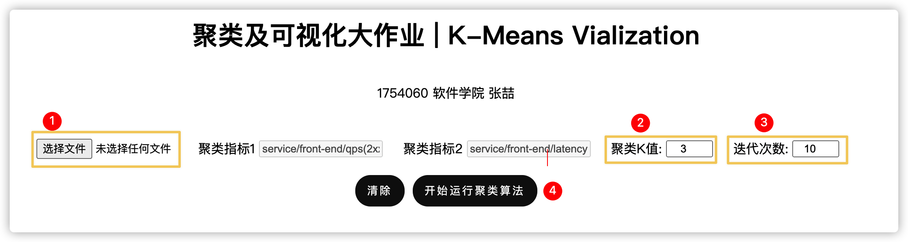
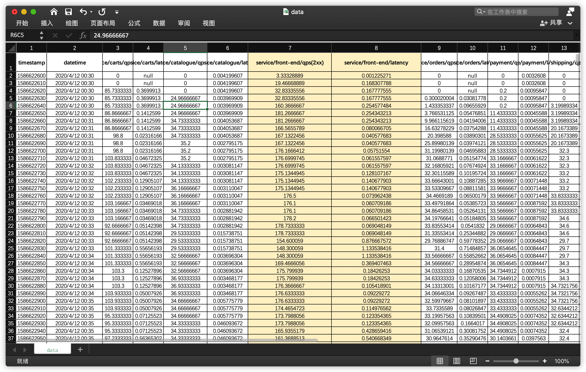
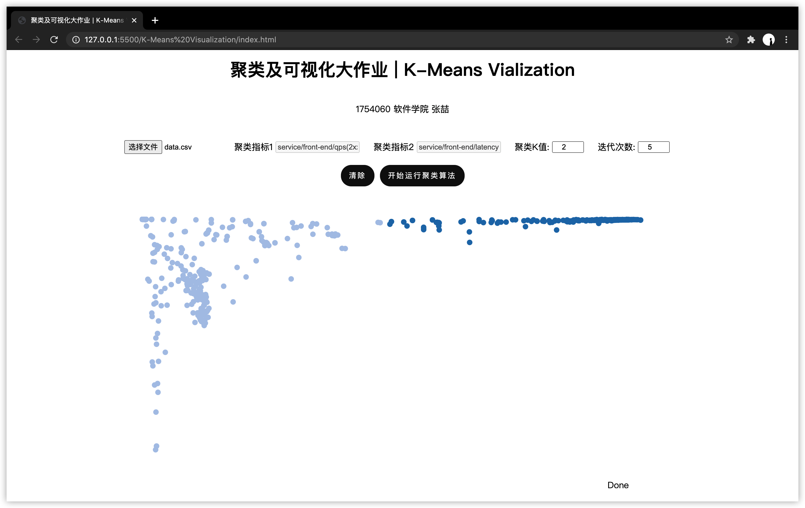
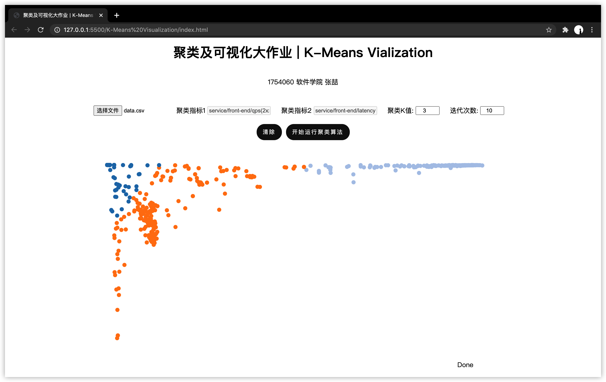
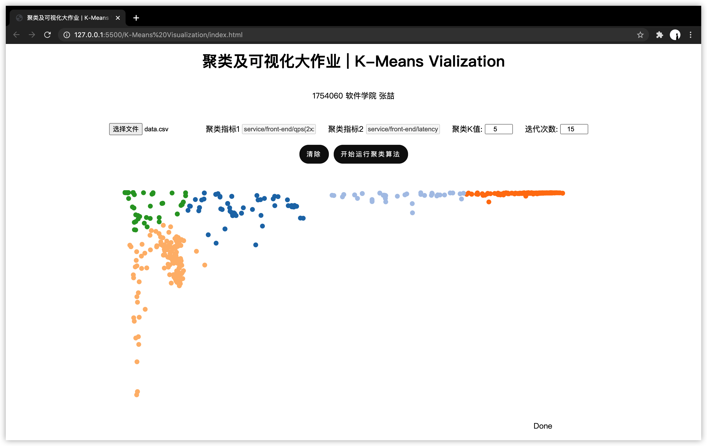
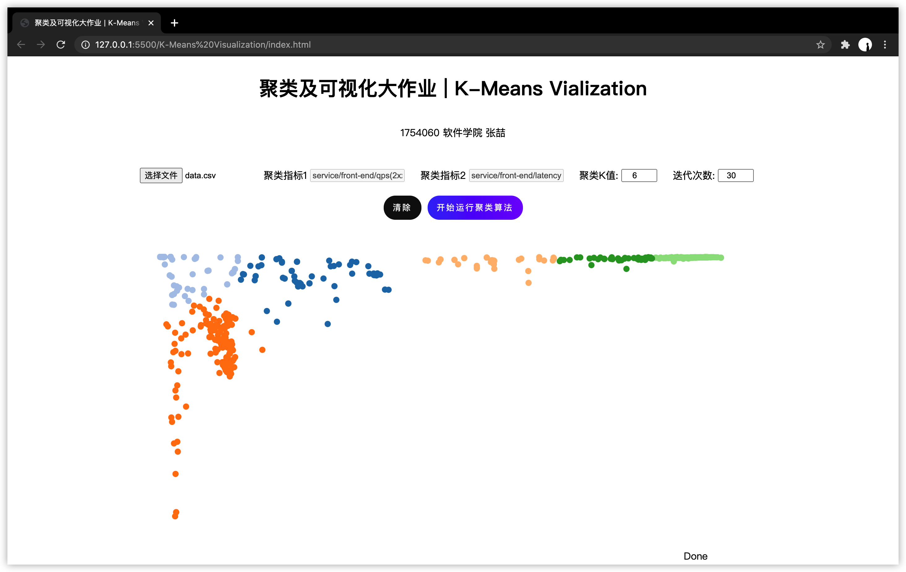
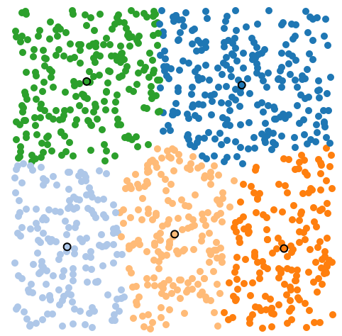
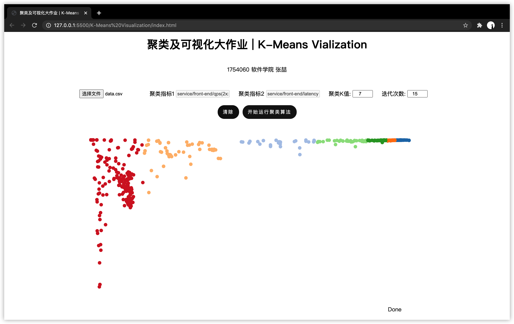

# 聚类及可视化大作业

<div align="center">1754060	软件学院	张喆</div>

[toc]

------

## 实验目的

调用已有的K-MEANS算法接口，在自行选取的数据集上进行实验，并采用一种可视化方法（D3）对实验结果进行可视化

<br/>

## 实验环境

- **操作系统**：macOS Catalina 10.15.7
- **IDE**：Visual Studio Code 1.45.1
- **开发语言**：HTML5 / CSS3 / JavaScript es6
- **主要依赖**
  - [d3.js](https://github.com/d3/d3)：可视化
  - [xlsx.core.js](https://github.com/SheetJS/sheetjs)：读取并处理excel(csv)文件

### 如何运行



1. 选取`data/data.csv`文件作为数据集
2. 输入指定聚类K值(默认为2)
3. 输入指定迭代次数(默认为10)
4. 点击开始运行聚类算法

> 注：聚类指标1和聚类指标2无法更改

### 项目结构

```
.
├── README.md
├── data
│   └── data.csv
├── index.html
├── lib
│   ├── d3.min.js
│   └── xlsx.core.min.js
└── static
    ├── css
    │   ├── kmeans.css
    │   └── style.css
    └── js
        ├── data-loader.js
        ├── kmeans.js
        └── main.js

5 directories, 10 files
```

<br/>

## 实验过程

1. 首先进行K-Means算法学习(详见下一部分)
2. 整理软件学院xlab实验室数据作为「聚类及可视化」大作业样例数据
3. K-Means算法复现和调试
4. 寻找可视化工具进行前端构建
5. 寻找中间键工具进行前后连接
6. 调试K-means算法和可视化并撰写实验报告

### 测试样例数据说明

> 测试样例数据位于`data/data.csv`中

该数据取自同济大学软件学院[杜庆峰教授](https://sse.tongji.edu.cn/Data/View/2817)xlab实验室“大型运维系统知识图谱”课题。



- **数据量**：1050条记录
- **数据指标**：第七列的service/front-end/qps(2xx)、第八列的service/front-end/latency

本课题通过规则的推理和基于深度学习的推理，根据大型云原生系统的历史运维数据建立模型，根据性能曲线找到发生问题的根因。

这里使用前端front-end的两项性能指标`qps(2xx)`和`latency`，通过聚类及可视化的方法找寻二者是否存在某些相关性。

> 由于数据尺寸的影响，在实际实验中分别将二者扩大5倍，方便进行观察

### K-Means算法

1. 随机初始化k个质心
2. repeat计算每个点到质心的距离
   - 这里采用欧几里得距离
3. 将每个点指派到最近的质心，形成k个簇
4. 重新计算每个簇的质心
   - 这里采用计算簇中各点的平均值(mean)
5. until质心不发生变化 或 变化<制定的阈值

### 核心算法实现

#### 获取并处理数据集

```js
/**
 * 读取本地Excel文件
 * @param {用户上传Blob文件} file 
 * @param {读取成功回调} callback 
 */
function readWorkbookFromLocalFile(file, callback) {
	var reader = new FileReader();
	reader.onload = function(e) {
		var data = e.target.result;
		var workbook = XLSX.read(data, {type: 'binary'});
		if(callback) callback(workbook);
	};
	reader.readAsBinaryString(file);
}

/* 获取数据 */
let sheetNames = workbook.SheetNames;
let sheet = workbook.Sheets[sheetNames[0]];
let csv = XLSX.utils.sheet_to_json(sheet);
let data_frontEnd_qps = [], data_frontEnd_latency = []
csv.forEach(function(row) {
  data_frontEnd_qps.push(row["service/front-end/qps(2xx)"]*5)
  data_frontEnd_latency.push(row["service/front-end/latency"]*5)
});
```

#### 聚类核心迭代算法

```js
/** 
  * 初始化迭代算法 并 启动定时器
	*/
function initialize() {
  // 初始化数据集和中心点
  centroids = initializePoints(numClusters, "centroid");
  points = initializePoints(numPoints, "point");

  // 创建初始图像
  update();

  var interval = setInterval(function() {
    if(iter < maxIter + 1) {
      iterate();
      iter++;
    } else {
      clearInterval(interval);
      setText("Done");
    }
  }, 2 * 1000);
}
```

#### 更新簇的质心

```js
/**
  * 更新中心点坐标 - 计算平均值
  * @param {聚类集群} cluster 
  */
function computeClusterCenter(cluster) {
  return [
    d3.mean(cluster, function(d) { return d.x; }), 
    d3.mean(cluster, function(d) { return d.y; })
  ];
}
```

#### 寻找最近质心

```javascript
/**
  * 寻找距目标点最近的中心点
  * @param {目标点} point 
  */
function findClosestCentroid(point) {
  var closest = {i: -1, distance: width * 2};
  centroids.forEach(function(d, i) {
    var distance = getEuclidianDistance(d, point);
    // 如果距离某个中心点更近则更新
    if (distance < closest.distance) {
      closest.i = i;
      closest.distance = distance;
    }
  });
  return (centroids[closest.i]); 
}
```

<br/>

## 测试结果

- K=2，maxIter=5

  

- K=3，maxIter=10

  

- K=5，maxIter=15

  

- K=6，maxIter=30

  

> 不采用该数据集而随机生成坐标点
>
> K=5，maxIter=10
>
> 

<br/>

## 总结与问题

​		通过本次实验，并结合网课关于聚类问题的学习，我深刻了解了K-Means聚类算法的实现流程和步骤，尤其是本次实验要求中结合真实数据进行分析和决策，更是让我看到了这门课与实际问题的结合。K-Means算法作为最基本但高效的聚类算法有很多值得我们吸收和归纳的地方，在之后更加复杂高级的聚类算法中也或多或少的可以看到它的影子。本次实验也是第一次应用可视化框架对数据进行可视化展示，并对聚类步骤进行动态展示，更是扩展了我的技能和思路。将理论和实践结合起来也正是这门课的初衷。

​		但是无论是本次实验还是基础K-Means算法都存在着一些问题，比如**初始质心的选择问题**，如果初始化时恰好能在日后的每个簇中选取一个初始质心则结果会很好，但是在一次次运行实验时发现这样的可能性是非常低的，因此最终对于该数据集的处理需要采用多次运行选取最佳效果的方式实现；**空簇问题**，在该数据集中数据分布较为分散，在一些极大/极小值的地方都存在着一些离群值，但由于该实验未采用预处理进行抽样、层次记录等，或后处理对聚类后的类簇进行分割、合并，导致很多离群值也被考虑在簇中；**聚集问题**，比如下图中当K值比较大，且初始的质心刚好较为集中时(最右侧直线区域)，会导致最终聚类的效果不尽如人意，无法将差别很大的类别进行区分，而只是代数上使得SSE(Sum of Squared Error)更小。



​		在之前学习聚类算法的例子中，都可以比较直观的观察原始数据的分布以决定类簇的数量K值，但在真实场景下，如本次实验通过分析`front-end`的两个参量属性，很难人为进行划分。数据工程所研究的是希望通过聚类结果指导我们更好的理解数据，通过本次实验，也切实的让我看到很多时候我们面对大数据时，要综合运用我们所学的知识，让数据更好的服务好我们的决策。

