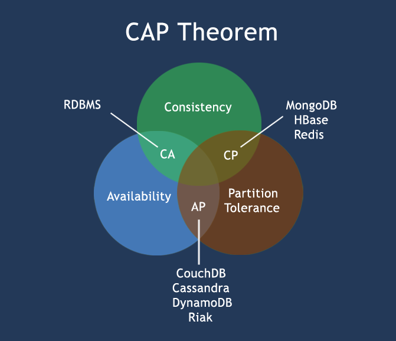
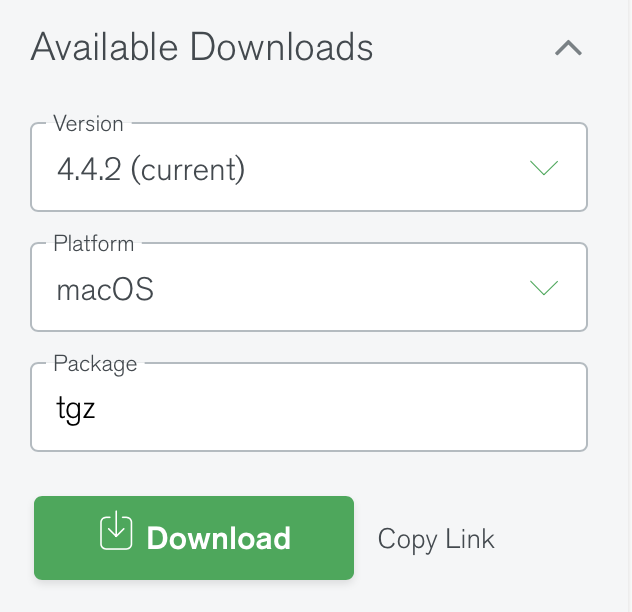
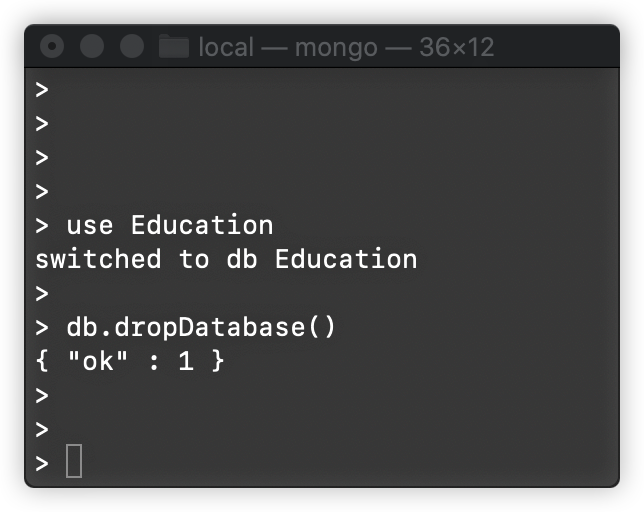

# 《实验二：MongoDB的安装与使用》实验报告

* [实验目的](#实验目的)
* [实验内容](#实验内容)
   * [分布式系统](#分布式系统)
   * [NoSQL](#nosql)
      * [CAP定理](#cap定理)
      * [BASE](#base)
   * [MongoDB](#mongodb)
* [实验步骤](#实验步骤)
   * [MongoDB的安装](#mongodb的安装)
   * [创建、删除数据库](#创建删除数据库)
   * [创建、删除集合](#创建删除集合)
   * [数据插入](#数据插入)
   * [数据查询](#数据查询)
   * [数据更新](#数据更新)
   * [数据删除](#数据删除)
   * [关于Capped Collection的问题](#关于capped-collection的问题)


------

## 实验目的
熟悉MongoDB的安装流程和基本使用

<br/>

## 实验内容
- 安装MongoDB
- 完成数据库和集合的创建，以及数据的插入、查询、更新和删除

### 分布式系统 
Distributed System，由多台计算机和通信的软件组成，通过计算机网络连接而成的。分布式系统是建立在网络上的**软件系统**
- **优点**
	- **可靠性**：一台服务器的系统崩溃不会影响到其余服务器
	- **可扩展性** / **灵活性**
	- **资源共享**
	- **速度更快 / 性能更高**：分布式计算系统有着多台计算机性能
	- **开放系统**：本地和远程都可以访问到服务器
- **缺点**
	- **故障排除**
	- **安全性**：开放系统和共享性会对安全性造成不小影响

### NoSQL
非关系型数据库(Not Only SQL)，不同于传统关系型数据库的统称，用于超大规模数据的存储，这些类型的数据不需要固定的模式，也无需多余操作就可以横向扩展
- 没有声明性查询语言，没有预定义的模式
- **优点**
	- 高性能、高可用性和可伸缩性
	- 分布式计算，低成本
	- 没有复杂的关系
- **缺点**
	- 没有标准化
	- 有限的查询功能
- **分类**
	- key-value存储：e.g. Redis
	- 列存储：方便存储结构化数据，方便做数据压缩
	- 文档存储：e.g. MongoDB
	- 图存储： e.g. Neo4j
	- 对象存储：通过类似面向对象语言的语法操作数据库
	- xml存储

#### CAP定理
一个分布式计算系统，不可能同时满足以下三点
	- 一致性Consistency：所有节点在同一时间具有相同的数据
	- 可用性Availability：保证每个请求不管成功或者失败都有响应
	- 分隔容忍Partition Tolerance：系统中任意信息的丢失或失败不会影响系统的继续运作


#### BASE
- Basically Abailble：基本可用
- Soft-state：“无连接” 软状态/柔性事务
- Eventual Consistency：最终一致性

### MongoDB
由C++编写的，基于分布式文件存储的开源数据库系统
旨在为Web应用提供可扩展的高性能数据存储解决方案，在高负载时添加更多的节点仍能保证服务器性能。
将数据存储为一个文档，数据结构由key- value组成，MongoDB文档类似于JSON对象。

<br/>

## 实验步骤

### MongoDB的安装
> 以 `macOS Catalina 10.15.7` 操作系统为例进行实验  

1. 登陆MongoDB官网下载安装包 [MongoDB Community Download | MongoDB](https://www.mongodb.com/try/download/community)，选择macOS版本

2. 将其移动到`usr/local/`目录下，并改名为`mongoldb/`
3. 将MongoDB的二进制命令文件目录添加到PATH路径中
4. 创建日志及数据存放的目录
	1. 数据存放路径
	2. 日志存放路径
5. 确保当前用户对以上两个目录有读写的权限

6. 在`.bash_profile`文件中增加PATH，并通过`source`重新启动

7. 在后台启动mongodb

9. 查看mongodb是否启动


### 创建、删除数据库
­创建数据库语法：**use** DATABASE_NAME
­删除数据库语法：db.dropDatabase()  
```bash
use Education
db.dropDatabase()
```



### 创建、删除集合
­创建集合(数据表)语法：db.createCollection(name, options)
­删除集合语法：db. COLLECTION_NAME.drop()

```bash
db.createCollection("student", { capped: true, autoIndexId: true, size: 6142800, max: 10000 })

db.student.drop()
```


### 数据插入
­语法：db.COLLECTION_NAME.insert(document)
```bash
db.student.insert({
	name: "Zhe ZHANG",
	age: 20,
	dept: "SSE"
})
```


### 数据查询
­语法：db.COLLECTION_NAME.find(query, projection)

```bash
db.student.find({ name: "Zhe ZHANG", age: {$gt: 18}})
```


### 数据更新
文档更新的基本语法：
```bash
db.collection.update(
	<query>,
	<update>,
	{
		upsert: <boolean>,
		multi: <boolean>,
		writeConcern: <document>
})
```
* <query>为查询条件
* <update>为更新操作符，常见的操作符为“$set”，即设置一系列值
* upsert为布尔型可选项，表示是否不存在文档则新建一个，默认为false
* multi为布尔型可选项，表示如果存在多个满足查询条件的记录，是否全部更新，默认值为false，即只更新第一条满足条件的记录
* writeConcern表示抛出异常的级别，一般使用时可以不做设置

```bash
db.student.update({"age": {$gt: 18}}, {$set: {"dept": "SSE"}})

db.student.update({"age": {$gt: 23}}, {$set: {"dept": "SSE"}}, true, true)
```


### 数据删除
文档删除语法：`db.collection.remove( <query>, justOne: <boolean>)`
* <query>为查询条件，justOne为可选的布尔型变量，说明对于满足查询条件的文档是全部删除还是只删除一条，默认参数为false，即删除全部满足条件的文档。

删除当前集合中的全部文档语法：`db.student.remove({})`

```bash
db.student.remove({ "age": {$gt: 18}}, true)
db.student.remove({})
```


### 关于Capped Collection的问题
Capped Collection 是一种特殊的集合，它大小固定，当集合的大小达到指定大小时，新数据覆盖老数据。Capped collections可以按照文档的插入顺序保存到集合中，而且这些文档在磁盘上存放位置也是按照插入顺序来保存的，所以当我们更新Capped collections中文档的时候，更新后的文档不可以超过之前文档的大小，这样话就可以确保所有文档在磁盘上的位置一直保持不变。
 
 失败的原因更新后的文档大小值不能超过原有空间，否则更新失败
- 创建固定集合不像普通集合，固定集合需要显示的创建使用 
- 创建固定集合必须指定其大小否则会报错： 

