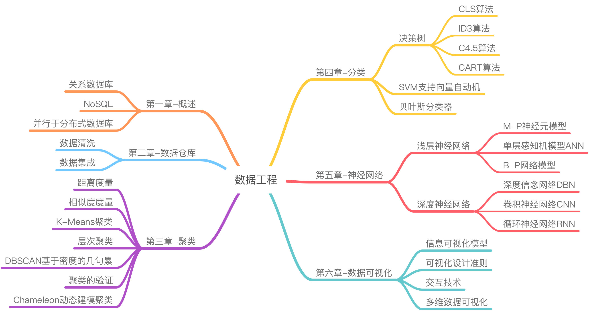

# 数据工程

* [知识域 | Body of Knowledge](#知识域--body-of-knowledge)
* [文档 | Documents](#文档--documents)
* [项目结构 | Project Structure](#项目结构--project-structure)
* [关于作者 | About the Author](#关于作者--about-the-author)

------

## 知识域 | Body of Knowledge

 

## 文档 | Documents

> 关注微信公众号「**济济一堂**」，后台回复「**数据工程**」即可获取

- 数据工程笔记(完整版)
- 数据工程测试题(整合版)

 

## 项目结构 | Project Structure

- `doc/`：《数据工程》课程笔记
  - [第一章-概述](https://github.com/doubleZ0108/Data-Engineering/blob/main/doc/第一章-概述.md)
  - [第二章-数据仓库](https://github.com/doubleZ0108/Data-Engineering/blob/main/doc/第二章-数据仓库.md)
  - [第三章-聚类](https://github.com/doubleZ0108/Data-Engineering/blob/main/doc/第三章-聚类.md)
  - [第四章-分类](https://github.com/doubleZ0108/Data-Engineering/blob/main/doc/第四章-分类.md)
  - [第五章-神经网络](https://github.com/doubleZ0108/Data-Engineering/blob/main/doc/第五章-神经网络.md)
  - [第六章-数据可视化](https://github.com/doubleZ0108/Data-Engineering/blob/main/doc/第六章-数据可视化.md)
- `RelationalDB/`：关系数据库相关实验
  - [《实验一：关系数据库的安装与使用》实验报告](https://github.com/doubleZ0108/Data-Engineering/blob/main/RelationalDB/README.md)
- `NoSQL/`：NoSQL数据库相关实验
  - [《实验二：MongoDB的安装与使用》实验报告](https://github.com/doubleZ0108/Data-Engineering/blob/main/NoSQL/README.md)
- `K-Means Visualization/`：聚类及可视化，以K-Means算法实现
  - [《聚类及可视化大作业》实验报告](https://github.com/doubleZ0108/Data-Engineering/tree/main/K-Means%20Visualization)
  - [k-means核心算法](https://github.com/doubleZ0108/Data-Engineering/blob/main/K-Means%20Visualization/static/js/kmeans.js)
- `Decision Tree /`：分类，以决策树算法实现
  - [《分类大作业 - 决策树ID3算法》实验报告](https://github.com/doubleZ0108/Data-Engineering/tree/main/Decision%20Tree%20)
  - [ID3核心算法](https://github.com/doubleZ0108/Data-Engineering/blob/main/Decision%20Tree%20/src/ID3.py)

 

## 关于作者 | About the Author

| 姓名         | 张喆                                                         |
| ------------ | ------------------------------------------------------------ |
| **指导老师** | [卫志华教授](https://see.tongji.edu.cn/info/1154/6940.htm)，[曹楠教授](https://nancao.org) |
| **课程名字** | 人工智能微专业 - 数据工程                                    |
| **联系方式** | [dbzdbz@tongji.edu.cn](mailto:dbzdbz.tongji.edu.cn)          |