# 《实验一：关系数据库的安装与使用》实验报告

* [实验目的](#实验目的)
   * [关系数据库](#关系数据库)
* [实验内容](#实验内容)
   * [MySQL](#mysql)
* [实验步骤](#实验步骤)
   * [本地端 - 以macOS平台为例](#本地端---以macos平台为例)
      * [检测mysql环境是否安装并登陆](#检测mysql环境是否安装并登陆)
      * [创建、删除、选择数据库](#创建删除选择数据库)
      * [创建与删除数据表](#创建与删除数据表)
      * [插入数据记录](#插入数据记录)
      * [查询数据记录](#查询数据记录)
      * [更新数据记录](#更新数据记录)
   * [服务端 - 以Ubuntu(Linux)平台为例](#服务端---以ubuntulinux平台为例)
      * [检测mysql环境是否安装并登陆](#检测mysql环境是否安装并登陆-1)
      * [创建、删除、选择数据库](#创建删除选择数据库-1)
      * [创建与删除数据表](#创建与删除数据表-1)
      * [插入数据记录](#插入数据记录-1)
      * [查询数据记录](#查询数据记录-1)
      * [更新数据记录](#更新数据记录-1)
   * [MySQL Workbench](#mysql-workbench)
      * [连接远程服务器](#连接远程服务器)
      * [查看刚才的表和数据](#查看刚才的表和数据)

------


<br/>

## 实验目的

熟悉**关系数据库**的安装与使用

### 关系数据库
- **定义**：指采用了关系模型来组织数据的数据库
- **模型**：二维表格模型，一个关系型数据库就是由二维表及其之前的练习所组成的数据组织
- **常用概念**
	- **关系**：一张二维表，每个关系都具有一个关系名，也就是表名
	- **元组**：二维表中的一行，在数据库中被称为记录
	- **属性**：二维表中的一列，在数据库中被称为字段
	- **域**：属性的取值范围，也就是数据库中某一列的取值限制
	- **关键字**：一组可以唯一标识元组的属性，数据库中常称为主键，由一个或多个列组成
	- **关系模式**：指对关系的描述。其格式为：关系名(属性1，属性2， ... ... ，属性N)，在数据库中成为表结构
- **优点**
	- 容易理解：二维表结构是非常贴近逻辑世界的一个概念，关系模型相对网状、层次等其他模型来说更容易理解
	- 使用方便：通用的SQL语言使得操作关系型数据库非常方便
	- 易于维护：丰富的完整性(实体完整性、参照完整性和用户定义的完整性)大大减低了数据冗余和数据不一致的概率
- **缺点**
	- `I/O`操作较慢，当系统并发行很高时，成为系统瓶颈
	- 数据量大时，查询效率低
	- 关系数据库扩展较难，需要进行停机维护和数据迁移，不能通过简单天假更多的硬件和服务节点来扩展性能和负载性能
	- 多表的关联查询会严重影响性能
- **主流关系数据库**：Oracle，Microsoft SQL Server，MySQL，PostgreSQL，DB2，Microsoft Access， SQLite，Teradata，MariaDB，SAP

<br/>

## 实验内容

- 安装MySQL或其他关系数据库
- 执行基本的SQL语句（增、删、改、查等）

### MySQL
- 开源，不需要支付额外的费用
* 使用标准的 SQL数据语言形式
* 可以运行于多个系统上，并且支持多种语言，包括 C、C++、Python、Java、Perl、PHP、Eiffel、Ruby 和 Tcl 
* 支持大型数据库，支持5000万条记录的数据仓库，32位系统表文件最大可支持4GB，64位系统支持最大的表文件为8TB
* 采用了GPL协议，可以修改源码开发自己的MySQL系统

<br/>

## 实验步骤

### 本地端 - 以macOS平台为例

> 由于电脑中之前已经安装过mysql环境，因此这里省略安装步骤，请老师见谅  

#### 检测mysql环境是否安装并登陆
```bash
mysql --version
mysql -u root -p
```
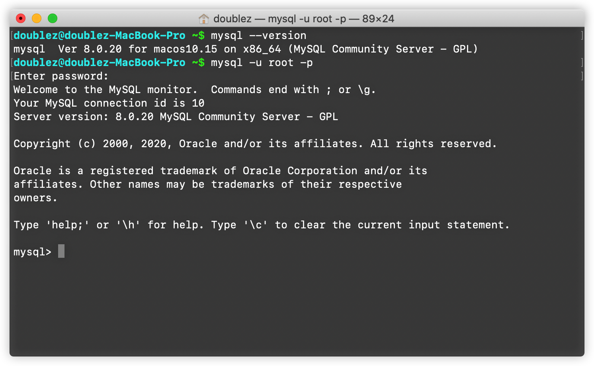

#### 创建、删除、选择数据库
```bash
create database Education;
use Education;
drop database Education;
```
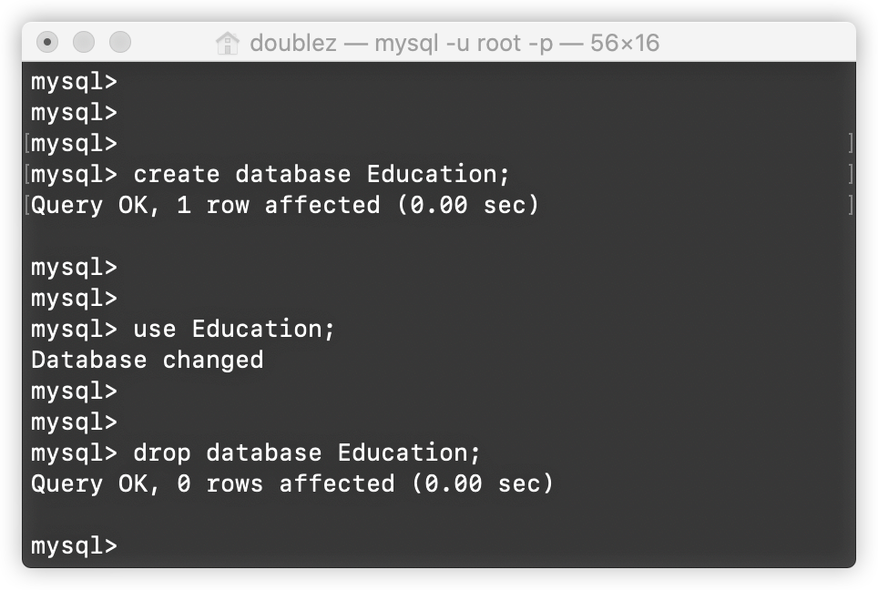

#### 创建与删除数据表
```bash
create table if not exists student(
	student_id INT UNSIGNED,
	student_name VARCHAR(40) NOT NULL,
	student_dept VARCHAR(100) NOT NULL,
	PRIMARY KEY (student_id)) ENGINE=InnoDB DEFAULT CHARSET=utf8;

drop table student;
```

#### 插入数据记录
```bash
insert into
	student(student_id, student_name, student_dept)
values
	(1754060, 'Zhe ZHANG', 'SSE');
```
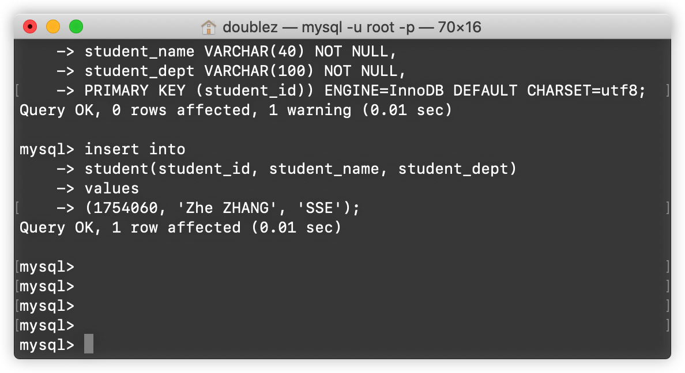

#### 查询数据记录
```bash
select
	student_id, student_name
from
	student
where
	student_id=1754060;
```
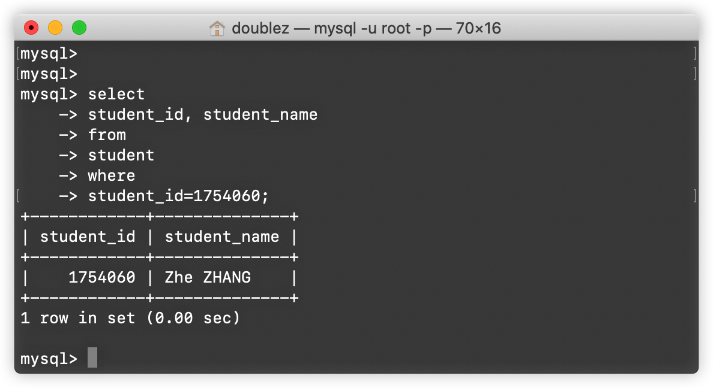

#### 更新数据记录
```bash
update student set student_name='DoubleZ ZHANG'
where student_id=1754060;
```
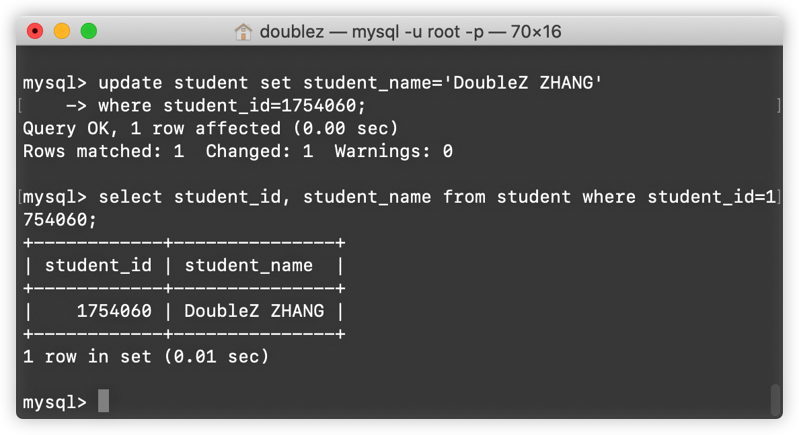

- - - -
### 服务端 - 以Ubuntu(Linux)平台为例

> 接下来，我使用阿里云服务器(Ubuntu 16.04.6)进行mysql相关实验，由于实现已经安装mysql环境，因此这里同样省略安装步骤，请老师见谅  
>   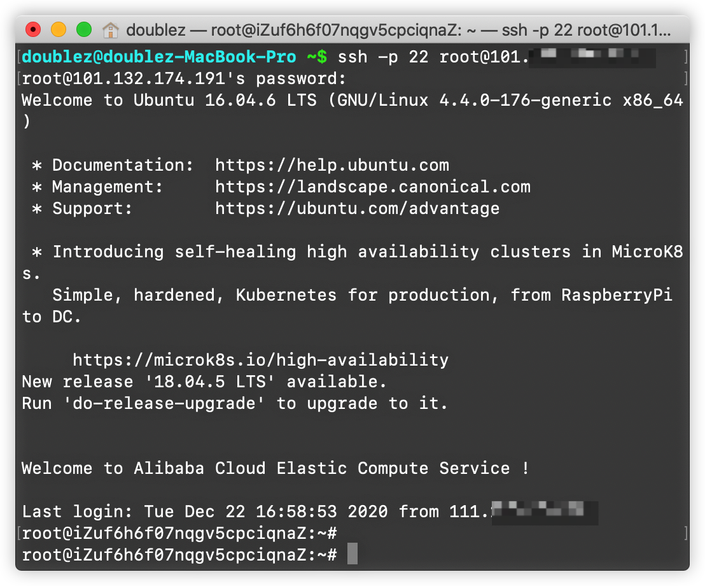  

#### 检测mysql环境是否安装并登陆
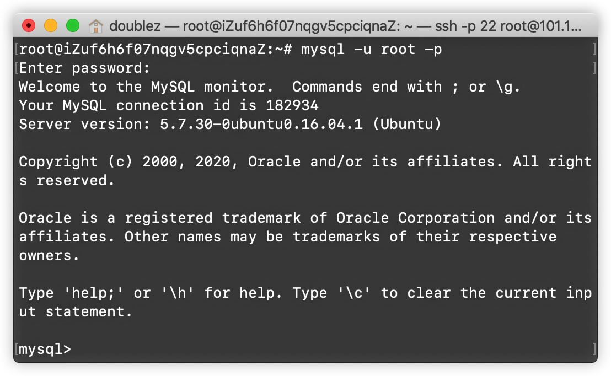

#### 创建、删除、选择数据库
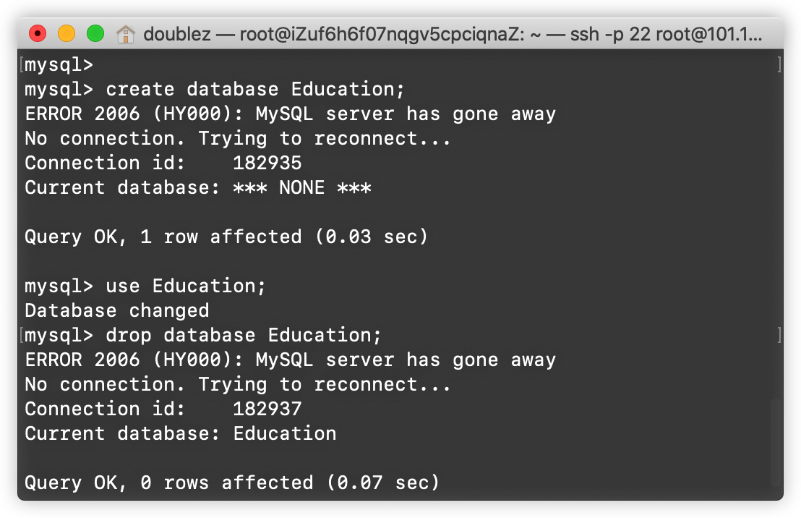

#### 创建与删除数据表
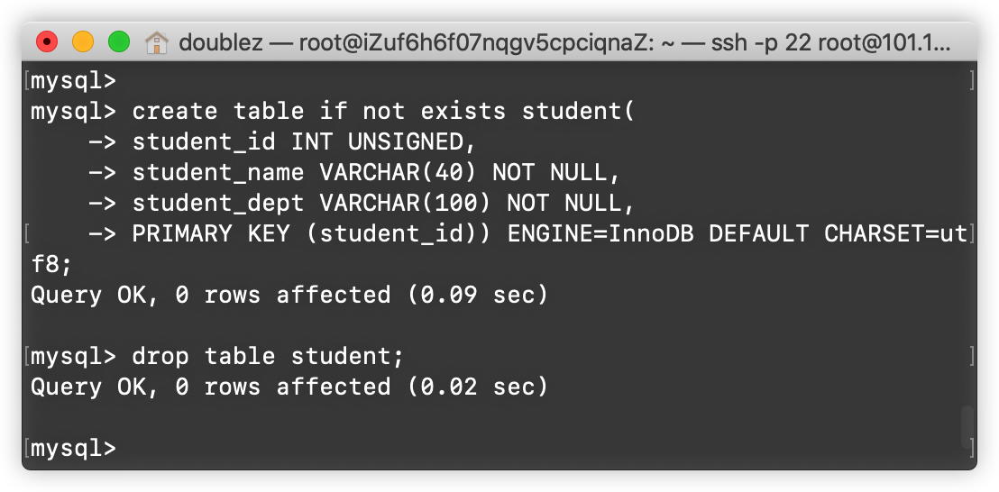

#### 插入数据记录
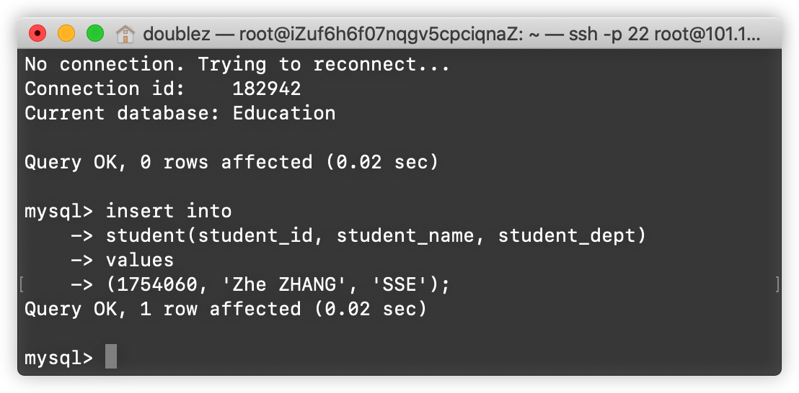

#### 查询数据记录
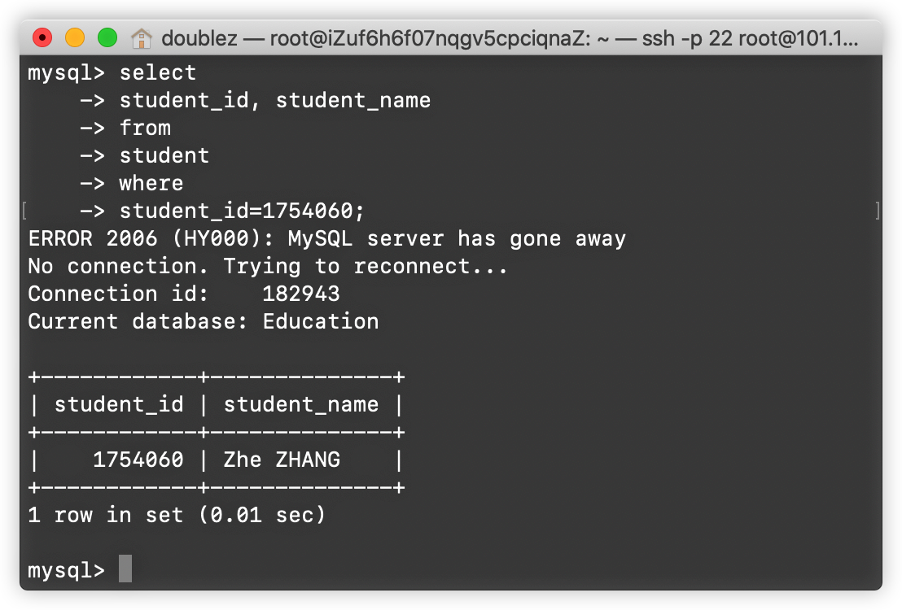

#### 更新数据记录
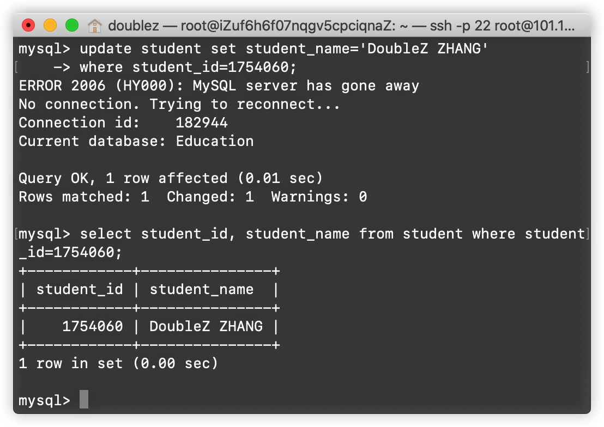

### MySQL Workbench
MySQL Workbench是GUI可视化的MySQL工具，接下来在成熟工具中进行实验
> **【官方介绍】**  
> MySQL Workbench is the official graphical user interface (GUI) tool for MySQL. It allows you to design, create and browse your database schemas, work with database objects and insert data as well as design and run SQL queries to work with stored data. You can also migrate schemas and data from other database vendors to your MySQL database.  

#### 连接远程服务器
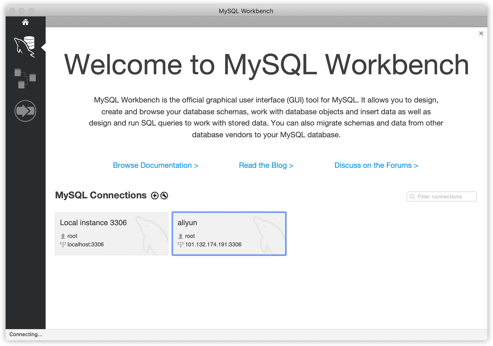

#### 查看刚才的表和数据
可以方便的使用可视化工具进行数据库的创建、删除；数据表的创建、删除；数据项的插入、查询、更新等操作
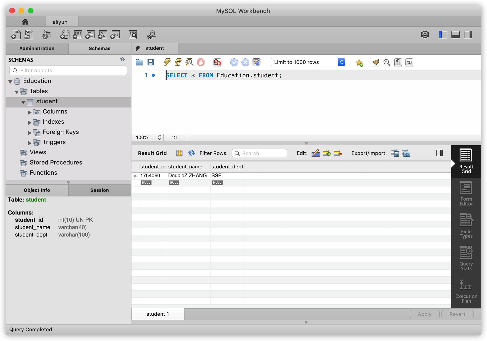