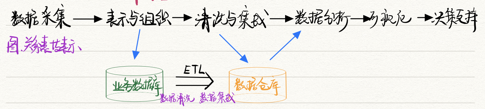
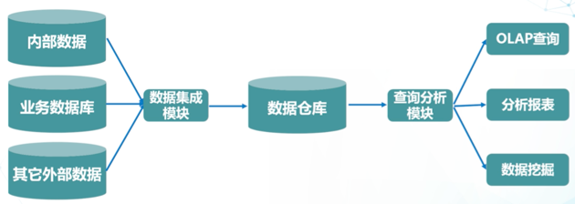
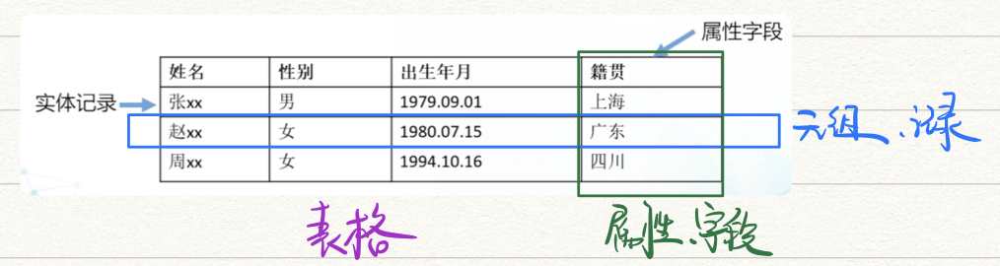
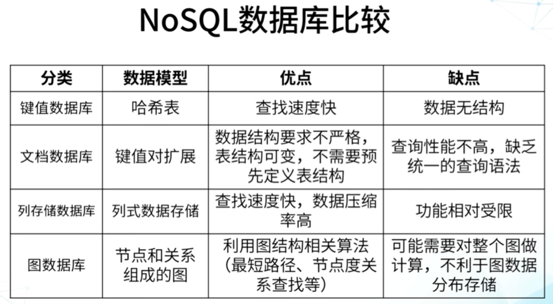
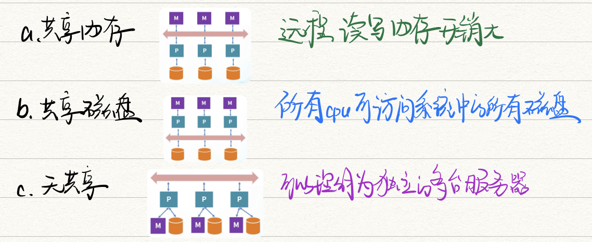
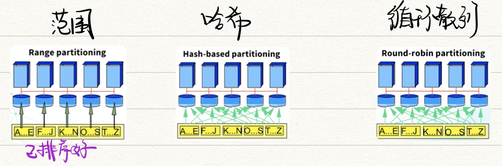

# 第一章 大数据与数据库

[toc]

------

- 大数据的**五维特征**

  - volume：数据量大 对存储要求高
  - velocity：增长速度快，对处理速度和实时性要求高
  - variety：来源和类型多
  - veracity：质量相对较低
  - value：价值密度低

- **为什么大数据火起来了？**

  - 数据收集～
  - 数据处理：计算速度（量子计算）～
  - 数据分析～

- **数据挖掘的价值**：数据 -> 信息 -> 知识

- **🌟大数据处理流程**

  

- 大数据**存储**

  

## 关系数据库

- 关系模型**完整性**
  - 实体完整性：每条记录有唯一性，通过主码标识
  - 参照完整性：主键和外健
  - 用户自定义完整性
- 主流关系数据库
  - 商用：Oracle、IBM DB2、Microsoft SQL Server、Microsoft Access
  - 开源：MySQL、PostgreSQL
- **DB安全**：用户认证、授权、审计（在数据库上操作进行记录，可以追本溯源）、加密、视图机制
- **🌟事务**：一组相互关联的DB操作，完成一定的业务目标
  - A 原子性
  - C 一致性
  - I 隔离性
  - D 持久性
- **缺点**：严格的数据模式、可扩展性差

## NoSQL

- **优点**：横向扩展；放松一致性约束 数据可以暂时不一致 但最终要一致；容错

- **🌟CAP理论**：C一致性、A系统可用性、P网络分区可容忍性 只能实现两个

  - C：任何时间所有备份有相同的值
  - A：部分节点故障后，集群整体还能提供服务
  - P：系统如果不能在时限内达成数据一致性，则认为发生了分区，必须在C和A之间进行选择

  > CA：关系数据库
  >
  > AP：NoSQL（放宽一致性约束，把数据和处理任务分布到大量节点上运行）

- **分类**

  - 文档DB：以xml、json等文件格式存储数据   🌰MongoDB
  - 列DB：一列所有数据放在一起，可以充分压缩，适合批处理   🌰HadoopDB
  - key-value DB：使用分布式环境，高度可区分    🌰Redis
  - 图DB：利用图形理论储存实体间的关系   🌰Neo4j

  

## 并行与分布式数据库

- **性质**：物理分布性；逻辑完整性；站点自治性

- **区别**

  - 并行：各服务器距离较近，可以共享内存、硬盘等、高速局域网
  - 分布式：通过公共网络连接

  > 分布式DB一般是并行DB，反之不成立

- **信息交换架构**：共享内存、共享磁盘、无共享

  

- **数据划分**：范围、哈希、循环散列

  
