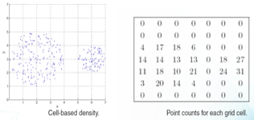

# 第三章 聚类

* [距离度量](#距离度量)
* [相似度度量](#相似度度量)
* [K-Means聚类](#k-means聚类)
* [层次聚类](#层次聚类)
* [DBSCAN基于密度的聚类](#dbscan基于密度的聚类)
* [聚类的验证](#聚类的验证)
* [Chameleon动态建模聚类(略)](#chameleon动态建模聚类略)
* [聚类算法比较表格](#聚类算法比较表格)

------

- **目标**：簇内相似性高、距离小；簇间相似性小、距离大

  - 无监督：让聚类自动帮我发现潜在目标
  - 具有不确定性

- **类型**

  - <u>划分聚类</u>(将data划分成非重叠的子集) / <u>层次聚类</u>(嵌套簇的集合组成树)

    

  - <u>独占聚类</u> / <u>非独占聚类</u>(一个点可以在多个簇中)

  - <u>模糊聚类</u>(数据某个簇是0～1间的权重) / <u>非模糊聚类</u>

  - <u>部分聚类</u>(排除离群点和不感兴趣点) / <u>完全聚类</u>

- **聚类形态**

  1. 明显分离：每个簇内对象到簇内对象比到之外近

  2. 基于中心的簇：每个簇内对象到簇的中心比到其他人的中心近

  3. 基于连通的簇：簇内每个点到簇中至少一个点的距离比到其他簇中任意点的距离更近

     - 最近邻、连通性

  4. 基于密度

     > 当簇不规则或互相盘绕，且有噪声和离群点时，通常用density

  

## 距离度量

- **欧几里得距离**：n维空间点中两点的真实距离  <u>如果不同属性尺度不同，要先标准化</u>
  $$
  \operatorname{dis} t=\sqrt{\sum_{k=1}^{n}\left(p_{k}-q k\right)^{2}}
  $$

- 闵可夫斯基距离：将欧式距离泛化到r次方
  $$
  \operatorname{dist}=\left|\sum_{k=1}^{n}(p k-q k)^{n}\right|^{\frac{1}{r}}
  $$

  - r = 1：曼哈顿街区距离
  - r = 2：欧式距离
  - r -> $\infin$：$L_{max}$范数；上确界；以向量任意分量的最大距离代表向量间距离

  > 🌰
  >
  > 

- **马氏距离**：考虑相关性
  $$
  \text { mahalanobis }(p, q)=(p-q) \sum^{-1}(p-q)^{T}
  $$

  - $\sum$：输入数据的协方差矩阵

  > 🌰 AC线性相关，距离更近
  >
  > 

## 相似度度量

> ❗️这里是点和点的相似度

- 一般属性

  - **一元属性**

    

  - **二元属性**：简单匹配系数；杰卡德系数

    > 🌰
    >
    > 

  - **余弦相似度**
    $$
    \cos \left(d_{1}, d_{2}\right)=\frac{d_{1} \cdot d_{2}}{\left\|d_{1}\right\|\left\|d_{2}\right\|}
    $$

    > 🌰
    >
    > 

  - **谷本系数(扩展杰卡德)**：针对连续或计数属性
    $$
    T(p, q)=\frac{p \cdot q}{\|p\|^{2}+\|q\|^{2}-p \cdot q}
    $$

- **相关性**：衡量对象间的线性关系

  - 标准化data: $A' = (A - mean(a)) / std(a)$

  $$
  \begin{array}{l}
  p_{k}^{\prime}=\left(p_{k}-\operatorname{mean}(p)\right) / \operatorname{std}(p) \\
  q_{k}^{\prime}=\left(q_{k}-\operatorname{mean}(q)\right) / \operatorname{std}(q) \\
  \text { correlation }(p, q)=p^{\prime} \circ q^{\prime}
  \end{array}
  $$

- **密度**

  - 欧几里得密度：单位体积内点的个数

    

  - 基于中心的欧几里得密度：把方形换成圆形

    

  - 概率密度

  - 基于图的密度

## K-Means聚类

1. 随机初始化k个质心
2. repeat计算每个点到质心的***距离***
3. 将每个点指派到最近的质心，形成k个簇
4. 重新计算每个簇的质心
5. until <u>质心不发生变化</u>｜<u>变化 < 阈值</u>

- **核心**：基于划分；每个点都指派给最邻近质心的簇

- **算法复杂度**：$O(n*k*I*d)$

  - n个点聚为k个类
  - I次迭代
  - d维属性

- **算法评价**：误差平方和SSE（越小越好）
  $$
  S S E=\sum_{i=1}^{K} \sum_{x \in C_{i}} \operatorname{dist}^{2}\left(c_{i}, x\right)
  $$

- **🌟初始质心的选择**

  - 多次运行
  - 预处理
    - 对原始数据抽样，并层次聚类，提取k个簇和他们的质心
    - 选择多余k个的初始质心，在其中选择分布广泛的k个
  - 后处理
    - 对聚类后大的类簇分割、合并（质心最接近的簇、使总SSE增加最小的簇）

- **🌟空簇问题**：某簇只有一个点，它是离群点

  - 预处理：数据归一化；去掉异常值
  - 后处理
    - 选择一个距当前任何质心都最远的点，去掉
    - 将最大SSE的簇继续划分
    - 每个点指派到簇后，随即更新质心（以前都是所有点都指派完才更新质心）
      - 开销大；确保不会产生空簇，可以动态的换SSE目标函数

- **🌟k怎么确定**：二分-K均值算法

  1. 将所有点划分成两个簇：2-means算法
  2. 选大的继续划分
  3. 直至SSE最小

- **局限性**

  

## 层次聚类

1. 计算相似度矩阵
2. 让每个数据点成为一个簇（整体为一个簇）
3. loop until只剩下一个簇（每个数据点成为一个簇）
   1. 合并两个最近的簇（分裂成两个簇）
   2. 更新相似度矩阵

- **类型**：凝聚；分裂

- **优**：不必假定簇数量

- **缺**：没有全局目标函数直接最小化；一旦决定合并不可撤回

- **复杂度**：$O(N^3) \rightarrow O(N^2logN)$    n-1个合并步骤，每一步搜索$n^2$规模的矩阵

- **🌟==簇==之间的相似度**：相似度始终是越大越好

  - 基于最小距离 / 单链：簇的相似性基于两簇中最近的两个点

    - 缺：对噪声和异常值敏感

    

> 🌰
>
> 

- 基于最大距离 / 完全链接

  - 优：不易受噪声和异常值影响

  - 缺：倾向于打破大类簇；对球状簇会产生偏差

  > 🌰
  >
  > 

  - 基于平均距离 / 平均链接

    - 优：对噪声不敏感
  - 缺：对球状簇会偏差

  - 基于Ward方法的簇相似度：簇的相似度基于两簇合并时平方误差的增量

    - 可用作k-means的分层初始化

## DBSCAN基于密度的聚类

1. 消除噪声，对剩余点执行聚类
2. 为距离在Eps内的所有核心点间赋予一条边
3. 每组联通的核心点形成一个簇
4. 将每个边界点指派到一个与之关联核心点的簇中

- **核心**：将核心点连起来  

- **两个超参数**

  - Eps：指定半径内的点数
  - MinPts：满足条件的近邻点数

  > 🔍如何确定Eps和MinPts？
  >
  > 思想：对于簇内的点到第k个近邻点的距离大致相同

- **三类点**

  - 核心点：一个点的邻域内包含的点数高于MinPts
  - 边界点：一个点的邻域内虽然低于MinPts，但该点落在核心点邻域内
  - 噪声点：既不是核心点也不是边界点

- **说明**

  - DBSCAN不是对所有点聚类
  - 算法不完全稳定：某点到两个核心的距离都小于Eps，先聚类的簇会抢到它

- **优**：对异常点不敏感；结果没有偏倚

- **缺**：样本密度不均匀时聚类质量较差；计算量大，收敛较慢；需要对Eps和MinPts联合调参

## 聚类的验证

- **测度/标准**

  - 外部测量：类簇标签和外部类标签的匹配程度（类似有监督）
    - 熵Entropy
  - 内部测量：不参照外部信息
    - 误差平方和SSE
  - 相对测量

- 聚类验证的**可视化**：计算两个矩阵的相关性  

  - 相似度矩阵

- 关联矩阵

  

- **内部度量方法**

  - SSE

    - 比较两组簇：K相同时，SSE越小越好
    - 比较两个簇：平均SSE越小，类簇越紧实
    - 出现拐点处适合作为K的个数

  - 内聚和分离

    - 内聚：簇内的误差平方和 WSS
    - 分离：簇间的距离平方和 BSS

    > WSS + BSS = 常数

  - 轮廓系数：$s = 1-\frac{a}{b} \ if \ a < b, \ else \ \frac{b}{a} - 1$

    - a: 每个点i到其所在簇内其他点的平均距离
    - b: min(i到其他簇中点的平均距离)
    - 取值范围$[0,1]$，越接近1越好

## Chameleon动态建模聚类(略)

- **核心思想**：适应数据集的特征来寻找自然簇

- **基于图的聚类算法**；簇是图的连通分量；稀疏化

- **衡量标准**：簇间相对接近度；簇间相对互联度

  - 如果二者达到一定阈值，则进行合并，这种方案保持了自相似性

  

## 聚类算法比较表格

