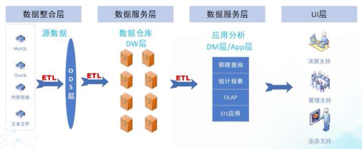
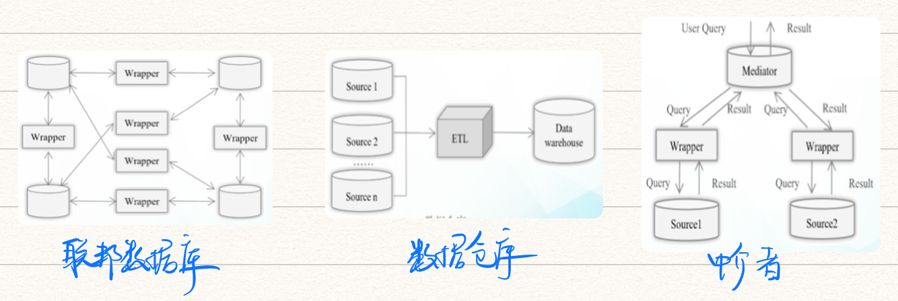

# 第二章 数据仓库

* [数据清洗](#数据清洗)
* [数据集成](#数据集成)

------

- **联机处理架构**

  - OLTP联机事务处理：运行在DB之上；数据实时更新、要求响应性高；面向业务   🌰银行
  - OLAP联机分析处理：运行在数据仓库之上，在大量数据上获得宏观汇总信息

- **特点**

  - 面向主题：要分析什么，就抽象归类什么
  - 集成：从原有分散的DB中集成而来
  - 不更新：只查询DW，不修改数据仓库中的数据
  - 时变

- **系统架构**

  

- **🌟ETL**：从DB中抽取、转换、加载data到DW中

  - extract：从不同DB等中抽取数据
  - transformation：相当于数据清洗，解决不一致的问题
  - loading：将清洗过的数据装入目标DW中

  > ETL可以多次使用

- 新技术

  - 多模态DB：多源、异构、跨领域
  - 联邦DB + 同态加密 + 查分隐私保护：数据可用性与隐私保护的矛盾
  - NewSQL DB：综合解决SQL可扩展性差 & NoSQL数据一致性低的问题  🌰TiDB、Google Spanner
  - 内存DB：高性能；数据持久化功能弱  🌰SQLite、SAP HANA

## 数据清洗

- 数据质量评估：正确性、唯一性

- **任务**：格式统一；完整性约束检查；缺失值；元组内部和之间的矛盾；合并重复值；检测离群值

- **🌟数据异常**

  - 语法异常：词法错误、值域格式错误、不规则取值
  - 语义异常：违反完整性约束、数据矛盾、重复值、无效元组
  - 覆盖类异常：值的缺失、元组的缺失

- **方法**

  - 数据分析：检测语法错误  🌰通过edit distance纠正拼写错误

  - 数据转换

    - 标准化：🌰男,女 -> 0,1
    - 规范化：🌰归一化到$[0,1]$区间

  - 重复数据清除

  - 统计方法

    > 离群值 ≠ 错误值

## 数据集成

把数据从多个源整合在一起，提供统一的视图

- **分类**

  - 物理式：从多个数据源 <u>拷贝</u> 到DW中
  - 虚拟式：数据仍保留在数据源中，通过上层抽象，提供视图进行查询

- **集成要解决的问题**

  - 数据管理系统的异构性：🌰Qracle | MySQL
  - 通讯协议的异构性：🌰JDBC | ODBC
  - 数据模式的异构性：🌰SQL | NoSQL
  - 数据类型的异构性
  - 数据取值的异构性：逻辑取值和物理取值
  - 语义的异构性：取值相同但含义不同

- **🌟集成模式**

  1. 联邦数据库：如果仅要在少数几个数据源之间通讯和集成；需要大量的wrapper进行ETL
  2. 数据仓库：完全从DB中复制一份到DW中；增量式更新
  3. 中介者：扮演数据源的虚拟视图，本身不保留data

  
