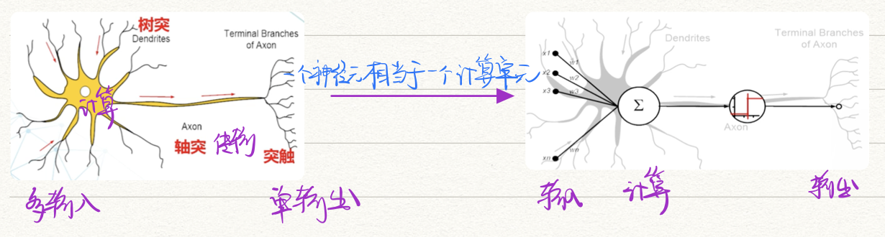
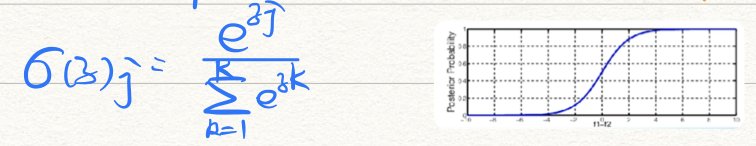

# 第五章 神经网络

## 浅层神经网络

**【分类】**

- 学习方式：有导师 / 强化学习 / 无导师
- 网络状态：连续性 / 离散型
- 网络结构：前向网络（分层结构） / 反馈网络（互连网络）
- 网络的活动：确定性网络 / 随机性网络  🌰 玻尔兹曼机、高斯机

### M-P神经元模型

- 树突：输入信号（多）
- 细胞核：计算
- 轴突：传输
- 突触：输出（单）

- $x_1...x_n$：神经元的n个输入信号量
- $w_i...w_n$：对应输入的权值（信号源与该神经元的连接强度）
- $\sum(U)$：神经元的输入综合（相应于生物神经细胞的膜电位，成为激活函数）
- $y$：神经元的输出
- $b(\theta)$：神经元的阈值

**【常见的激活函数】**

- 阈值型：电位大于某个阈值时激活；否则神经元不激活
- S型：反映神经元的非线形输出特征
- 分段线性型

### 单层感知机模型ANN

- 激活函数采用阈值型

- 能实现布尔逻辑(二分类)，但只能线性分类

- **算法**

  

  - 循环终止条件
    - 循环次数控制法
    - 精度控制法
  - 调整权重
    - 最小均方误差LMSE
    - 梯度下降规则 delta
  - 训练方式
    - 增量式
    - 批处理式

  > 单层感知机无法解决「异或」的问题

### B-P网络模型

- **核心**：有监督；误差反向传播

- **特点**

  - 优：广泛的实用性和有效性
  - 缺：训练速度慢（循环计算）；局部极小点的逃离问题（随机权值）；算法不一定收敛（参数影响很大）；接受样本的顺序对学习有较大影响（更偏向较后出现的样本）

- **结构**

  

- **学习过程**

  - 前馈计算（求解误差）：逐层逐单元前馈计算
    - 通过简单非线形函数的复合可得到复杂非线性映射能力
  - 反馈计算（误差反向传播）：梯度下降的反方向
  - 计算每个权重的调整量

- **分析与改进**

  - 克服收敛慢、陷入误差局部极小：反向传播时，在每个权重变化上加入一项动量项，利用附加栋梁作用滑过极小值

    

  - 样本：训练集、检验样本（10%以上）、测试样本（10%以上）

    - 经验上 |training set| > 5 |set of weights|

  - 提高泛化性：因为追求过小的误差，使网络对训练样本点学习太精致，以至于记住的不是训练样本的一半特征而不是局部特征

    - 适当的训练精度  🌰将grand truth从1,0 --> 0.99,0.01
    - 提前停止
    - 给样本增加随机噪声  🌰(x1,x2) --> (x1+e1, x2+e3)

  - 隐藏层数量：越多越精确；但容易过拟合、开销大

  - 输入信号归一化：训练时会出现饱和现象，即增加输入数量，但输出不变

    - 应使所有样本输入平均值接近零或与方差相比很小
    - 均值平移 -> 去相关PCA -> 协方差均衡

  - 权重初始化：建议在(-2.4/F, 2.4/F)内随机初始化；F为输入单元数

  - 激励函数：常用双曲正切

------

## 深度神经网络

- **发展基础**：数据爆炸；计算性能大幅提升

### 深度信念网络DBN

- 无监督

- **概率生成模型**：底层通过限制<u>玻尔兹曼网络</u>（层间无连接；层内有连接）让整个网络按最大概率<u>生成训练数据</u>

- 常将多层玻尔兹曼网络后叠加BP网络

  - 也可看成是对深层BP网络权值的初始化

- 对比散列CD

  - 开始时用训练数据初始化可见层，然后用条件分布计算隐层
  - 再根据隐层用条件分布计算可见层，产生对结果的一个重构

  

### 卷积神经网络CNN

- **特点**

  - 神经元间是非全连接的
  - 同一层中某些神经元间连接的权重是共享的（减少参数）

- **网络结构**

  

  - **输入层**：二维矩阵（黑白图像）；三维矩阵（RGB）

  - **卷积层**：用于提取特征，复合卷积核特征的神经元被激活

    $h(x)=f(x) * g(x)=\int_{-\infty}^{+\infty} f(t) g(x-t) d t$

    - 卷积核：一个filter上对应像素的权重值

    - 步长：卷积核在图像上一次移动的步长

    - 局部连接：前一层局部神经元经过卷积连接下一层的*<u>一个</u>*神经元

    - 平移不变性：前一层不同位置的像素共享卷积核权重，改变对象位置只改变下层激活神经元的位置，而不影响存在性

      > 图像识别中，同一类别的图像往往只有细微差别，局部平移不变性大大提高了图像分类的准确性

  - **池化层**：下采样（对feature map提取再加工）

    - 又一次提取特征，减少参数，提高计算效率
    - 种类
      - 最大池化：增强局部特征（提取轮廓）
      - 平均池化：减少噪声（模糊图像）
    - 提高局部平移不变性，对输入的微小变化产生更大的容忍
    - 进一步获取更抽象的信息，防止过拟合

  - **全连接层**：分类器，用学到的特征进行分类

    

    - 激活函数：softmax归一化指数函数，将输出映射到[0,1]

      

- **超参数**

  - 学习率：训练时更新权重的幅度
  - 层数：与特征提取有关
  - 卷积层：卷积核大小、数量、步长、填充、激活函数
    - 输出通道数 = 卷积核数
  - 池化层：采样大小
    - 输出通道数 = 输入通道数

- **分析与改进**

  - 梯度消失问题：对sigmoid函数求骗到得到的数值偏小，层数过多时，梯度更新几乎为0

  - 局部感知与权值共享

    

  - 填充padding：保持边界信息

  - 归一化：解决过拟合

    - 损失函数添加L1、L2范数正则化
    - batch normalizatioin
    - Dropout：随即将某些权值不更新  $\delta \in (0,1)$
      - 训练时随机忽略$\delta$比例的神经元，只更新剩下神经元的权值
      - 检测时使用全部连接，每个神经元 * $\delta$

  - 特征可视化：低层提取简单特征；高层提取复杂特征

    

- 成熟CNN模型：LeNet、AlexNet、NIN、GoogLeNet、残差ResNet

### 循环神经网络RNN

引入**“记忆”**概念，对<u>序列数据</u>建模。预测不只依赖于input，还依赖于之前的一部分信息

- 同层间的信息在时序上流动
- RNN中共享一组参数，减少参数量
- 🌰 自然语言处理；视频；气象观测数据；股票数据
- **双向RNN**：不仅依赖之前的序列，还可能依赖后面的  🌰文本补全
- **BPTT基于时间的反向传播**：引入时序演化，将整个序列作为一次训练，要求每个时刻的误差求和
  - 问题：梯度消失；梯度爆炸
  - 解决方案：激活函数更新 ReLU
  - 改进网络结构 LSTM