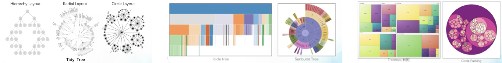

# 第六章 数据可视化

[toc]

------

- **领域分支**

  - 科学可视化：物理世界里采集的
  - 信息可视化：对抽象数据的直观展示
  - 可视分析

- **可视化评估**

  

  - **t检验**：评估两组数据的均值是否存在统计学上的显著差异
    - 单一样本t检验：将总体的平均值与理论值进行比较
    - 非配对双样本t检验：比较两个独立样本的均值（组间）
    - 配对t检验：两组相关样本的均值（组内）

## 信息可视化模型

抽象数据 -> 数据结构 -> 可视化

- **数据处理**
  - 数据清洗：去除噪声，提取有用信息  🌰过滤、取样、压缩、分类、聚类等
  - 数据变换：改变存储形式  🌰无结构data -> 有结构
  - 数据抽象：🌰社交网络 -> 图
- **可视化设计**
  - 信：准确表达数据，不产生偏差和歧义
  - 达：高效传递数据中的信息
    - 可视化编码：如何用<u>图形符号</u>及<u>属性</u>展示数据元素
      - 符号：点、线、面
      - 属性：颜色、形状、大小
  - 雅：美观
- **可视化布局**：通过算法自动计算元素在屏幕上的位置，**优化过程**   🌰避免点的遮挡、线的交叉
- **可视化渲染**
- **可视化交互与动画**

## 可视化设计准则

- **信**

  - 控制图形中的<u>谎言因子</u>

    - 衡量可视化中所表达的数据量与数据之间夸张程度的度量
      $$
      LF = \frac{\text{可视化中元素的相对变化量}}{\text{数据的真实变化量}}
      $$

    - 一般要求LF位于0.95~1.05之间

  - 不要将数据的展示脱离其上下文

  - 展示数据变换而非设计变化

- **达**

  - 最大化<u>数据墨</u>水占比

    - 可视化图形中不可被擦出的核心部分
      $$
      \text{Data-Ink Ratio} = \frac{\text{数据墨水}}{\text{绘制中的所有墨水}}
      $$

    - 擦出非数据墨水   🌰但如刻度坐标轴有很大含义

    - 擦出冗余数据墨水   🌰但如对称图形不好只保留一半

  - 利用人类感知系统的特点，更快的感知信息

    - 减少感知可视化信息的耗时
    - 减少模式识别过程的耗时

  - **格式塔**

    

  - **🌟可视化编码**

    - 可视化符号：元素和元素之间的关系
      - 元素：点、线、面
      - 关系：闭包、连线
    - 可视化通道：数据属性、控制符号的展现形式
      - 数值通道：🌰*<u>位置</u>*、长度、角度、色温 etc.
      - 表示通道：🌰*<u>空间区域</u>*、色相、动向、形状

- **雅**：审美问题（这里略）

## 交互技术

- **常见交互类型**

  - 选择：标记感兴趣点并追踪其变化  🌰地图上标及地点
  - 导航：展示数据的不同子集
  - 重构：改变空间布局以提供不同视角
    - 重组视图 / 排序
  - 编码：视觉外观 颜色、大小、图表样式等
  - 抽象 / 具象：层次结构
  - 过滤：基于限定条件展示数据
    - 动态查询 / 刷选直方图
  - 关联：高亮显示data间relationship
    - 刷选 & 连接

- **常见交互范式**

  - **概览 + 细节**：用户先对整体有个印象，如果想深入再查看细节
    - 滚动
    - 缩放和平移
  - **焦点 + 上下文**：显示焦点的细节信息 + 焦点周边的信息
    - 可变形形变
      - 压缩不重要的部分，突出重点
      - 行变函数 / 放大函数

- **可视化动画**

  - 作用

    - 帮助理解数据：展示中间步骤和过渡
    - 提升用户关注度：提供新视角，辅助用户更深入的查看数据
    - 关联视图：在两个视图间平滑过度

  - 实现

    

## 多维数据可视化

- **数据的维度**：用于描述data的各种属性

- **🌟数据维度的类型**

  - 分类属性
  - 有序属性
  - 数据属性

- **数据之间的差异性**

  - 差异阵：每个取值代表元素之间的数据距离

- **🌟坐标系｜可视空间**

  

  - **正交投影空间**

    

  - **非正交投影空间**

    - MDS：相似度结构分析
    - ISO Map：用测地距离反映元素之间的相关性

  - **平行坐标轴系统**：每一个轴代表一个维度

    - 消除视觉混乱（维度太多）
      - 基于数据过滤和聚类
      - 基于坐标轴排序优化
      - 基于视觉增强

    

- **树的可视化**：层次化data

  - 点线图
  - 邻接图
  - 包含图

  

- **图的可视化**

  - 点线图：布局问题 / 角度问题
    - 力导向布局：迭代求解，使点与点间相互位置的势能降到最低
      - 可以用弹簧模型 用距离模拟力，当力平衡时势能最小
  - 邻接矩阵
  - 混合

  
