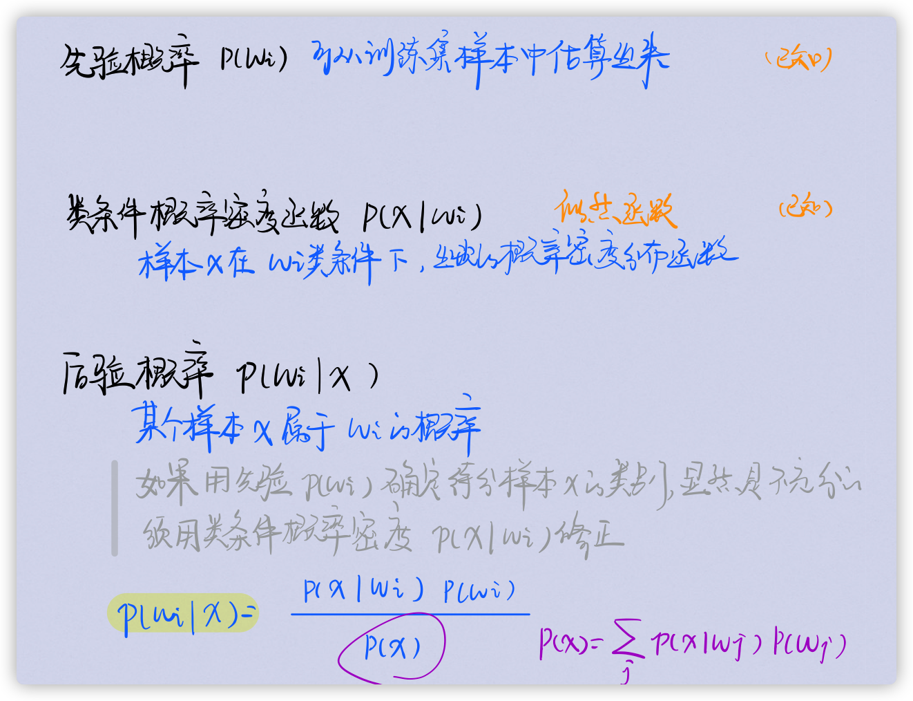

# 第四章 分类

[toc]

------

- **大数据分析分类**
  - 有监督分析
  - 无监督分析
  - 分类
  - 回归（数值预测）：根据所给data建立回归模型，推测未知或缺失的data
- **分类过程**：train  -->  validation  -->  test
  - valid：在独立的验证集上验证，防止过拟合

## 决策树

由数据的不同属性逐次划分dataset，直至得到的数据子集只包含同一类数据为止，这样得到的树成为决策树

- 由树的根到某个叶属性的合取可形成一条分类规则
- 所有规则的析取形成一整套分类规则（什么条件下得到什么值的规则）

- **🌟决策树生成算法**：自上而下递归的分治法构建树
  - 开始时所有训练样本都在根
  - 用一定的模型***<u>选择属性</u>***生成分支
    - 模型：试探｜统计   🌰信息增益、熵
    - 一般树越小，预测能力越强
  - 停止分裂
    - 对于一个给定的节点，所有的样本属于同一类
    - 没有剩余属性用于进一步区分，则分类叶子采用多数投票方式
  - 直至所有样本都被计算
- **🌟决策树修建算法**：防止噪声和过拟合
  - 预剪枝：在生成树的同时决定是否继续对不纯的训练子集划分还是停止
  - 后剪枝：拟合-化简的两阶段方法
    - 首先构建一棵train完全拟合的树
    - 使用一个测试集(tuning set)从叶开始剪枝，如果某个叶子剪去后测试集上的准确度不降低，则剪去改叶子

### CLS算法

早期决策树的基本框架，但并没规定属性选择的方法

### ID3算法

- **🌟熵**

  - 熵越小，不纯度越小，不确定信息越小，越有利于数据分类
  - 决策树的分支原则是使划分后样本的子集熵最小

  $$
  \operatorname{entapy} (S)=-\sum_{i=1}^{n} p_{i} \log _{2} p_{i}
  $$

  - 参数含义
    - train set $S$
    - $n$个类别样本，类别分别为$C_i$
    - 属于类$C_i$的概率为$p_i$
  - 如果将n类样本看成n种不同的消息，则熵表示对每一种消息编码所需的平均比特数
    - $|S|\times entropy(S)$为对S进行编码所需的比特数；$|S|$为样本数目
    - $p_i = \frac{1}{n}$时，$e(S) = log_2 n$  ==样本概率分布均匀，混杂度高，信息熵大==
    - 所有样本属于同一类时，$e(S) = 0$

- **🌟信息增益**：衡量熵期望的减少值

  - 信息增益越大，因为知道A导致熵的压缩越大，A对分类提供的信息越多

  - ==选择获得最大信息增益的属性作为分支属性==
    $$
    gain(S,A) = entropy(S) - entropy(S,A) \\
    \operatorname{entropy}(S, A)=\sum_{i=1}^{m} \frac{\left|S_{i}\right|}{|S|} \operatorname{entropy} \left(S_{i}\right)
    $$

    - 设属性A将S划分成m份
    - $S_i$为根据属性A划分S的第i个子集

- **基本策略**：使用信息增益作为启发知识帮助选择合适的属性将样本分类

- 算法

  

- **递归停止条件**

  - 给定节点的所有样本属于同一类
  - 没有剩余属性可用来进一步划分样本，这时候该节点作为树叶，并用剩余样本中出现最多的类型作为叶节点的类型
  - 某一分支没有样本，则以训练集种占多数的类型创建一个树叶

- **评价**

  - 优：容易理解；噪声影响较小；分类速度快
  - 缺：非递增算法；结果非全局最优
    - 倾向于选择有大量不同取值的属性，产生小而纯的子集

### C4.5算法

- **🌟增益比例**：信息增益的标准化
  $$
  gain\_ratio(S,A) = \frac{gain(S,A)}{I(S,A)}
  $$

  - 信息量 $I(S,A)$
    $$
    I(S, A)=-\sum_{i=1}^{m} \frac{\left|s_{i}\right|}{|s|} \log _{s} \frac{\left|s_{i}\right|}{|s|}
    $$

  - 样本S在属性A上的取值分布越均匀，信息量越大

  - 用来衡量属性分裂数据的广度和均匀性

- **算法特点**

  - 分支指标采用增益比例
  - 将处理能力扩充到数值属性
    - 按数值属性的大小对样本排序，每次划分数值属性的取值范围
    - 每一个数值属性划分为两个区间：大于阈值｜小于等于阈值
  - 处理缺少属性值的训练样本
    - 最常用值代替
    - 该属性所有取值的平均值代替
    - 概率填充
  - 使用K次迭代交叉验证

- 算法

  

- **特点**

  - 优：准确率高；分类规则易于理解
  - 缺：效率低（构建树时要对dataset进行多次顺序扫描和排序）

### CART算法

- **🌟Gini基尼不纯度指标**
  $$
  \operatorname{Gini}(p)=\sum_{k=1}^{k} p_{k}\left(1-p_{k}\right)=1-\sum_{k=1}^{k} p k^{2}
  $$

  - p(选中) * p(分错)
  - 表示一个随机选中的样本在子集中被分错的可能性
  - ==Gini越小，数据越纯，不确定性越小==

- **算法特点**

  - 二元划分：二叉树不易产生数据碎片，精度高
  - 不纯性度量：
    - 分类目标：Gini指标
    - 连续目标：最小平方残差、最小绝对残差
  - 剪枝：用独立的dataset对训练集的生成树剪枝，防止过拟合

- 算法

  

- **CART剪枝**

  - 在预测误差和树复杂度间找到平衡
  - 极小化决策树整体的损失函数或代价函数实现

  > 首先从生成算法产生的决策树T0底端开始不断剪枝，直到T0的根结点,形成一个子树序列[(TO,T1....Tn)
  > 然后通过交叉验证法在独立验证数据集上对子树序列进行测试，从中选择最优子树

- **特点**

  - 优：计算少速度快，非参数方法
  - 缺：容易过拟合；性能和样本有较大关系

------

## SVM支持向量自动机

- 背景理论（略）

  

  - 经验风险最小 =/=> 期望风险最小
  - 样本数量越多，置信风险越小，越有可能学习正确
  - 分类函数VC维越大，置信风险越大，推广能力越差
  - ==提高样本数量，降低VC维，降低置信风险==

- SVM建立在VC维理论和结构化风险最小原理基础上

  - 结构化风险 = 经验风险 + 置信风险
    - 经验风险：分类器在给定样本上的误差
    - 置信风险：分类器在未知样本上分类结果的误差

- **核心思想**：寻找一个满足分类要求的超平面，并且使训练集中的点距离分类面尽可能的远  ==（寻找一个分类面使两侧的空白margin最大）==

- **线性SVM**

  - **核心思想**：寻找决策平面 $w^Tx + b = 0$，使训练样本中正负类输入分别位于超平面两侧，且

    - 经验风险最小（错分最少）
    - 推广能力最大（空白最大）

    > 求一个平面使两类被分开且间隔最大 

- **优化函数**： $min\frac{||w||^2}{2}$

- 采用拉格朗日乘子法

- 改进：加入松弛因子，用广义分类面求解

- 算法步骤：略

- **非线形SVM**

  - **核心思想**：用非线性映射将原始数据变换到高维特征空间，在高核空间用线性SVM求解

  - 核函数：要能真实的反应训练样本的远近关系

    

  - **特点**

    - 决策函数只由少数的支持向量确定，与样本空间维数无关，避免“维数灾难”
    - 抓住关键，剔除冗余

------

## 贝叶斯分类器

用概率统计的方法研究决策问题，根据每一类总体的概率分布决定未知类型的样本

- **前提要求**

  - 各类别的总体概率分布是已知的
  - 要决策分类的类别是一定的

- **概率论背景知识**

  

- ==用后验概率分类$p(w_i|x)$==

- 两类Bayes决策

  - **最小错误率**

    - **决策规则**：$max_{j=1...c} \ \ p(w_j|x)$
    - 误差概率：$min[\ p(w_i|x) \ ]$

  - **最小风险**：对样本的分类不仅要尽可能给出正确的判断，而且还要考虑到做出错误判断的后果，把<u>分类错误的损失</u>加入到决策中去

    - **三个空间**：状态空间$w$ / 决策空间$a$ / 损失空间$\lambda(a,w)$

      - 用决策表或损失矩阵表示三者的关系  

    - **两种风险**

      - 条件风险：条件期望损失，即后验概率加权和

    $$
        R\left(a_{i} \mid x\right)=E[\lambda_{\left(a_{i}, h_{j}\right)}]=\sum_{i=1}^{c} \lambda\left(a_{i}, w_{j}\right) P\left(w_{i} \mid x\right).
    $$

      - 期望风险：反映对整个特征空间所有x的取值都采取相应的政策$a(x)$所带来的平均风险

    $$
        R=\int R(a(x) \mid x) p(x) d x
    $$

    - **决策规则**：如果采取每个决策$a_i$使条件风险$R(a_i|x)$最小，则对所有x作决策时期望风险R也必然最小

  $$
      \begin{array}{l}
      R\left(a_{1} \mid x\right)=\lambda_{11} p\left(w_{1} \mid x_{1}\right)+\lambda_{12} p\left(\omega_{3} \mid x\right) \\
      R \left(\operatorname{a}_{2} \mid x_{1}\right)=\lambda_{21} p\left(w_{1} \mid x\right)+\lambda_{22} p\left(c_{2} \mid x\right) \\
      \text { 取 } \min \left\{R\left(a_{1} \mid x\right), R\left(a_{2} \mid x\right)\right\}
      \end{array}
  $$

  > 🌰

  - **两类Bayes决策的关系**

  - 若正确决策没有损失，错误决策损失均为1，则最小错误率 == 最小风险

  - 若损失对称，则二者方法相同 $\lambda_{12}-\lambda_{22}=\lambda_{21}-\lambda_{11}$

- 正态分布下的Bayes决策（略，完全看不懂）

  
